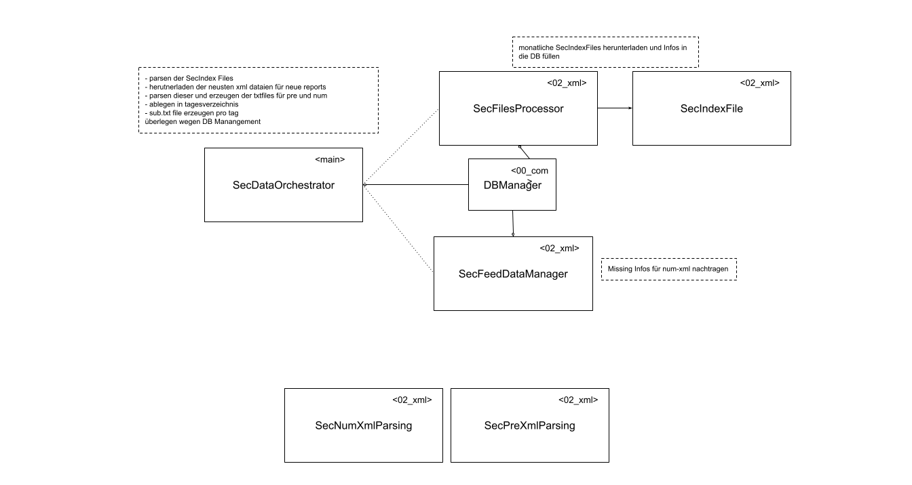

https://github.com/adam-p/markdown-here/wiki/Markdown-Cheatsheet
# Overview

## Data
### FeedFiles xbrlrss-yyyy-mm.xml
Enthalten items, welche edgar:xbrlFiling infos enthalten.
- companyName
- formType
- filingDate
- cikNumber
- accessionNumber
- fileNumber
- acceptanceDtetime
- period
- assistantDirector
- assignedSic
- fiscalYearEnd
- List: xbrlFiles
 
Wichtig: Es können noch die letzten Einträge des vorherigen Monats vorhanden sein.

## DB
### "sec_feeds"
|column|description|
|---|---|
|companyname||
|formtype||
|filingDate||
|cikNumber||
|accessionNumber||
|fileNumber||
|acceptanceDatetime||
|period||
|assistantDirector||
|assignedSic||
|fiscalYearEnd||
|xbrlInsUrl||
|xbrlCalUrl||
|xbrlDefUrl||
|xbrlLabUrl||
|xbrlPreUrl||

- Es gibt Tage, an denen werden massiv mehr Reports angereicht, als an anderen
SELECT "filingDate", COUNT(*) FROM sec_feeds GROUP BY "filingDate";

## Classes
### SecProcessingOrchestrator

Ist verantwortlich für das Bereitstellen der Daten. Dieses geschieht in mehreren Schritten:
1. Die Informationen der Filings müssen runtergeladen und in der Tabelle sec_feeds ergänzt werden.
2. Diese Filingsdaten müssen mit den fehlenden "num"-urls ergänzt werden.
3. Noch nicht verarbeitete Einträge müssen runtergeladen und geparsed werden. 
    1. pro Tag werden die Daten aller Firmen in ein eigenes Verzeichnis gespeichert (evtl. gezipt)
    2. In der Tabelle wird eingetragen, welches Filing verarbeitet wurde und an welchem Tag die Verarebeitung stattfand
4. Es muss berechnet werden, welche Tage sich verändert haben. entsprechend müssen DeltaFiles generiert werden.
    1. Frage: sollen die DeltaFiles verschiedene filingdates beinhaltet können, also ist das DeltaFile auf das Verarbeitungsdatum bezogen? das wäre vlt. am einfachsten
    2. Es könnte auch geprüft werden, ob FilingDates zeitnah verarbeitet werden
    
    
